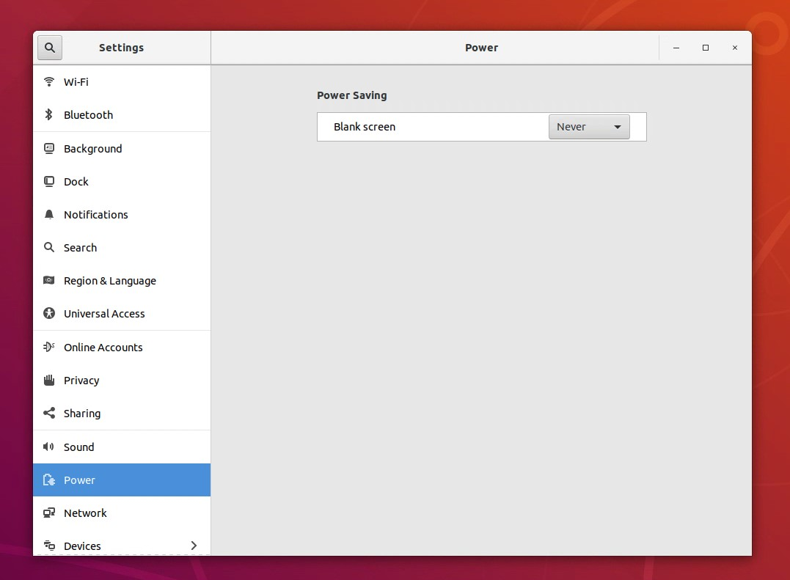

# 6.106 Student Software: Athena VDI
Welcome to 6.106! This document will direct through how to get setup with your VM for the class and all the software you will need to use during the class.

## Part 1: MIT Athena and VMWare Horizon
Each student will have access to their own VM (Virtual Machine) hosted by Athena VDI (Virtual Desktop Infrastructure). You wil need a VMWare Horizon client to access your VM. The client will provide you with a GUI to use the VM similarly to how you use the OS running on your machine. 

Read here to learn more about the computing services provided by Athena: [Athena Computing Environment](https://ist.mit.edu/athena)

Follow the following instructions to get setup with your Athena VDI VM:

1) **MIT VPN:**
    
    In order to access Athena VDI, you must either be on MITnet on campus or connect using an MIT VPN service to download or use Horizon. To get setup with MIT VPN service, following the instructions here:

    [MIT VPN](https://ist.mit.edu/vpn)

    [Instructions for Prisma Access VPN](http://kb.mit.edu/confluence/display/istcontrib/Prisma+Access+VPN+Landing+Page)
2) **VMWare Horizon**:

    To access your VM, you will need to install the VMWare Horizon Client and configure it to access Athena VDI. Follow the following instructions (check the list of potential problems below the link if you run into one while following the instructions):

    [Instructions for VMWare Horizon Client ](http://kb.mit.edu/confluence/display/istcontrib/Horizon+Virtual+Desktops+and+Computer+Labs+Landing+Page)

    **Problems you might run into while going throw the instructions above:**

    1. The Install VMWare Horizon Client button may not work. Use the link below it to see the full list of VMWare Horizon Clients. Download VMware Horizon Client for Windows version 2206.
    2. If your browser complains that it cannot verify the certificates/certificates authority when trying to access https://vdi.mit.edu/, you can ask it to trust it.
    3. If the same problem in (2) shows up in VMWare Horizon, you can do the following:
        
        1. Go to Preference/Settings in VMware Horizon.
        2. Go the Security tab
        3. Select "Do not verify server identity certificates", but be careful to switch this back if you try to use the same client to connect to some other virtual desktop that is not Athena VDI. You can also choose "Warn before connecting to untrusted servers", but you might receive the warning every time you try to log into Athena VDI and the client will ask you if you want to ignore the warning or not.

3) **6.106 VM**

    Once you finish the setting up the VMWare Horizon Client, you should have access to two types of machines once you access At: 

    a) *Virtual athena*: the VM provided to everyone at MIT.

    b) *6-106-EECS*: the VM that is custom designed for 6.106 and the one that you should use.

4) **Disable Power Saving**:
    1. Once you access your `6-106-EECS` VM, make sure to disable power saving. This is to avoid your virtual machine locking you out.
    2. Click on the arrow in the top right of your Ubuntu virtual desktop
    3. click on settings (lower left circle)
    4. Click on Power in the left bar
    5. Make sure `Blank Screen` is set to `Never`

    
    
    
5) **Using VMWare Horizon**:
    1. At the top right of your VMWare Horizon App, there should be three dots that give you some options. Some of these options are:
        <ol type="a">
        <li><B>Reset Desktop (NEVER USE THIS):</B> </li>
        Wipes your VM and resets it to the image that we have given you. So, you lose any setup or software you have installed. Note that you will not lose anything stored on AFS. You should <B>NEVER</B> use this option.</li>
        <li><B>Restart Desktop:</B></li>
        Restart your VM. Similar, to when you restart your OS on your personal computer.
        <li><B>Logoff Desktop:</B></li>
        Closes your VM session and terminate all the processes running. You can think of this as shutting down your VM.
        <li><B>Disconnect Desktop:</B></li>
        Closes your VM session, but it will </B>not</B> terminate the running processes. The VM will be kept on for up to 3 hours for your to log back in and resume your running work.
        </ol>

        You should always practice closing your VM session when you are not using it with **Logoff Desktop/Disconnect Desktop**. In certain situations, if your laptop goes to sleep or shutdowns while a session is open, the VMWare Horizon Client might log off incorrectly and you will get locked out of your VM when you try to log back in a subsequent session. In that case, you will either need to **Restart Desktop**. If you have important unsaved work that you can't afford to lose or if restarting doesn't work, contact the class staff on Piazza. Try not to get yourself into those situations.

        <B>WARNINGS:</B>
            
        1. Always choose Logoff Desktop when you are done using your virtual desktop.
        2. Don't close your VMWare Horizon Client while having an active session. First, Logoff your session. Then, close the client.
        3. Try not to let your machine go to sleep while having an active session. 
## Part 2: MIT Athena and AFS

Your VM home directory is your locker directory on AFS (Andrew File System) which is the a distributed network file system. So, everything you do there will be backed by a distributed storage system and can be retrieved if your break your VM. To learn more about AFS, read the following [document](https://sipb.mit.edu/doc/afs-and-you/). You don't need to go through everything in the document, but it might me useful to read sections 1-3.1 to understand the filesystem better.

## Part 3: Configure your 6.106 VM
1. **Add the class locker**:
    Open a terminal and run:

        add 6.172

    to add the class locker
1. **Configure MIT GitHub**
    1. Log in to [MIT GitHub](https://github.mit.edu/) with your Touchstone/Kerberos account.
    2. Open a terminal in your 6.106 VM and run:
        ```
        github-setup-6106
        ```
        Follow along with the prompt about creating a [GitHub Personal Access Token](https://github.mit.edu/settings/tokens).

2. **Clone this repository**

    1. Inside the terminal from the previous step, clone this repository:
        ```
        git clone git@github.mit.edu:6106-fall22/student_software.git
        ```
        It will ask you whether to trust the github.mit.edu SSH key. Allow it.

3. **Install the 6.106 software**
    1. The script will ask you to enter the root password, you can find it by running:
        ```
        tellmeroot
        ```
    2. Inside the same terminal, after cloning the repository, run:
        ```
        cd student_software
        ./athena_vdi/install.sh
        ```

        <!-- [Deprecated on Athena VDI because we cannot ssh]
        Make sure to copy the last few lines of the output when the script prompts you to do so.
         -->
    3. Close your terminals and open a new one for some setup to be effective.
    
4. **git configuration**
    1. Configure git to use your favorite editor. For example, to use vim:

            git config --global core.editor vim
<!---
4. **Configure SSH Keys locally**
    1. Open a terminal on your host computer (NOT inside the VM)
    2. Run `cat ~/.ssh/id_rsa.pub`
        1. If that command fails because the file does not exist, run `ssh-keygen -t rsa`. Pres enter until it finishes; the defaults are fine.
        2. Run `cat ~/.ssh/id_rsa.pub`
--->

## Part 4: Using the Software

### VSCode:
Visual Studio Code is the development environment we recommend using. It has many builtin features that are useful for big projects development. The setup script your ran before should have installed the newest version for you!

You won't be able to access VS Code through the GUI or by typing "code" into the command line. This is due to some features not being available on AFS.

You can alternatively run it from the terminal using:

        run-vscode-6106

This will launch vscode and you should be able to pass parameters to it, like you would normally use `code`.

### Clang
Clang is the C compiler that we will use in this class. We provide a custom version of clang that is built with OpenCilk. If you want to compile some file through the command line or while writing Makefiles, you will want to use:

        clang-6106

### awsrun
awsrun is the program you will use to submit jobs to the class AWS instances for reliable performance benchmarking. You will learn more about his during your first homework. You can use it by running:

        awsrun [binary]

## Part 5: Test

1. **Open the `student_software` folder in VS code**
    It will prompt you whether to install the recommended extensions. Install them. 
        
    If you miss the prompt:
    1. Press Ctrl-Shift-P
    2. Type `Extensions: Install Extensions` and select that option
    3. Look to the Recommended tab of the Extensions menu
    4. Click Install on each of the recommended extensions.

**If the extensions fail to install, restart VS Code and try installing them again.**

2. **Build the student_software test program**
    1. Start a new terminal in your VM or inside the `student_software` VS Code window, click on Terminal, then Select New Terminal
    2. Inside the Terminal, run (You can ignore warnings/messages printed by the LLVM Gold plugin during compilation):
        ```
        cd ~/student_software
        make
        ./test_program
        awsrun ./test_program
        ```
        If everything worked correctly, you should see the following output.

        ```
        kerberos@virtual-athena:~/student_software$ make
        clang-6106 -std=gnu11 -Wall -fopencilk  -O3 -DNDEBUG -ftree-vectorize -flto=full -march=native -Weverything -Werror -Wpedantic  -o fib.o -c fib.c
        clang-6106 -std=gnu11 -Wall -fopencilk  -O3 -DNDEBUG -ftree-vectorize -flto=full -march=native -Weverything -Werror -Wpedantic  -o sum.o -c sum.c
        clang-6106 -std=gnu11 -Wall -fopencilk  -O3 -DNDEBUG -ftree-vectorize -flto=full -march=native -Weverything -Werror -Wpedantic  -o main.o -c main.c
        clang-6106 -lrt -lm -fopencilk -flto -lXext -lX11  -o test_program fib.o sum.o main.o


        kerberos@virtual-athena:~/student_software$ ./test_program
        Welcome to 6.106!


        ~/student_software$ awsrun ./test_program

        Submitting Job: ./test_program
        Waiting for job to finish...
        ==== Standard Output ====
        Welcome to 6.106!


        ==== Standard Error ====
        ```

        **If you did not see that, please let the staff know in a Piazza post, office hours, or recitation.**

## Part 6: Troubleshooting Athena VDI FAQ
Please, read the following [FAQ](TROUBLESHOOTING.md) to familiarize yourself with some of the problems people have run into in the past and how to fix them.

## (OPTIONAL) Part 7: Use Athena Dialup to Mount your locker locally

These are optional instruction on how to mount your locker directory locally on your machine through vscode or `sshfs`. You can completely rely on Athena VDI to complete the assignments for this class. You should only follow these steps if you prefer to minimize your interaction with the GUI provided by VMWare Horizon.

Athena Dialup is another way to get access to computing power on the Athena Infrastructure. You will have access there to your AFS directory as well. So, your home directory will be the same as in Athena VDI. 

Athena Dialup only provides access to some machine through ssh, so you will only get access to a terminal on that machine. 

    Note: on Athena Dialup, some software necessary software to work with the class might not run through athena dialup. We don't recommend trying to run software for the class from Athena Dialup

The nice thing is that you will be able to access your files from both ends. So, you can have both running. Use Athena Dialup for writing code on your AFS locker, but then switch to the Athena VDI GUI to run tasks.

1. Configure your development environment

    1. **Install VS Code**
        1. On your computer (NOT inside of your 6.106 VM), download and install Visual Studio Code from https://code.visualstudio.com/download
    2. **Install the Remote - SSH extension**
        1. Open VS Code
        1. Press Ctrl-Shift-P (on Windows/Linux) or Cmd-Shift-P (on Mac)
        2. Type `Extensions: Install Extensions` and select that option
        3. In the search box, paste: `ms-vscode-remote.remote-ssh`
        4. Install this extension
    3. **Restart VS Code**
    4. **Configure your SSH config**
        1. Open VS Code
        2. Press Ctrl-Shift-P (on Windows/Linux) or Cmd-Shift-P on Mac
        3. Type `Remote-SSH: Open Configuration File` and select that option
        4. Choose the first file
        5. Add the following entry to the file:
            ```
            Host athena
                HostName athena.dialup.mit.edu
                User [Your Kerberos without @mit.edu]
            ```
            It is likely, however, that this setup won't work, when you try to connect in the next step, since Athena Dialup uses two factor authentication. In that case, there is a fix that works if you are running Linux/MacOS (If you are running Windows, you will need to connect with `sshfs`. See below for more information). You will need to change the entry above to:
            ```
            Host athena
                HostName athena.dialup.mit.edu
                User [Your Kerberos without @mit.edu]
                ControlMaster auto
                ControlPath ~/.ssh/sockets/%r@%h-%p
                ControlPersist 600
            ```
2. **Connect with VSCode to Athena Dialup**
    1. Open VS Code
    2. Press Ctrl-Shift-P (on Windows/Linux) or Cmd-Shift-P on Mac
    3. Type `Remote-SSH: Connect to Host` and select that option
    4. Select `athena`
    5. It should ask you to do a two factor authentication. You should be able to enter your kerberos password, then use Duo. If your connection keeps resetting, then you will need to go back to step `6.3.4.5` and fix the ssh config entry (this would work for Linux/MacOS). If you are running Windows, see step `6.5` on how to use `sshfs`.
    6. Click "Open folder". You might be asked to authenticate again here.
    7. You can now choose which directory you want to load into your vscode from your Athena directory (this should be your home directory or a homework/project directory).

3. **Using sshfs to mount your AFS directory locally**:
    
    If you have gone through the previous steps and failed to ssh to athena dialup through VSCode (most likely you are using Windows), you can follow the following instructions to learn how to use `sshfs`/`fusermount3`. (Note: on older versions of Ubuntu, 18.04 or older, the command you will need to use is `fusermount` and the package to download it with is called `fuse`)
    1. If you are on Windows, the easiest way to be able to run the commands above is to use WSL to run Ubuntu. You can download Ubuntu20.04 through the Microsoft Store. It will provide with an Ubuntu terminal to run Linux executables.
    2. Install `sshfs` and `fusermount3`:
        ```
        sudo apt install sshfs
        sudo apt install fusermount3
        ```
    3. You can learn about both commands by reading the man pages:
        1. `sshfs`: https://man7.org/linux/man-pages/man1/SSHFS.1.html
        2. `fusermount3`: https://man7.org/linux/man-pages/man1/fusermount3.1.html
    4. You should create a directory to always mount you AFS directories to:
        ```
            mkdir ~/athena    
        ```
    5. Mount your Athena home directory locally (which is your AFS directory):
        ```
        sshfs kerberos@athena.dialup.mit.edu: ~/athena 
        ```
        Or mount a specific directory:
        ```
        sshfs kerberos@athena.dialup.mit.edu:/path/to/directory ~/athena
        ```
    6. Once you are done using the mounted filesystem, you should remember to always unmount it:
        ```
        fusermount3 -u ~/athena
        ```
    7. It might be worth it to create aliases for the commands above in order to avoid typing them every time by adding the following two lines to your `~/.bash_aliases` file.
        ```
        alias mount_athena="sshfs kerberos@athena.dialup.mit.edu: ~/athena"
        alias unmount_athena="fusermount3 -u ~/athena"
        ```
        
        You will have to close and rerun your terminal for these commands to be usable or just run
        ```
        source ~/.bash_aliases
        ```

        Now you can simply run them with:
        ```
        mount_athena
        unmount_athena
        ```
    8. Now you can open projects on your AFS directory like you would any other directory in VSCode:
        ```
        cd ~/athena/path/to/project
        code .
        ```
4. Install awsrun:
    
    1. From your Athena Dialup terminal, run:
    ```
    ./scripts/install_awsrun_athena_dialup.sh
    ```
